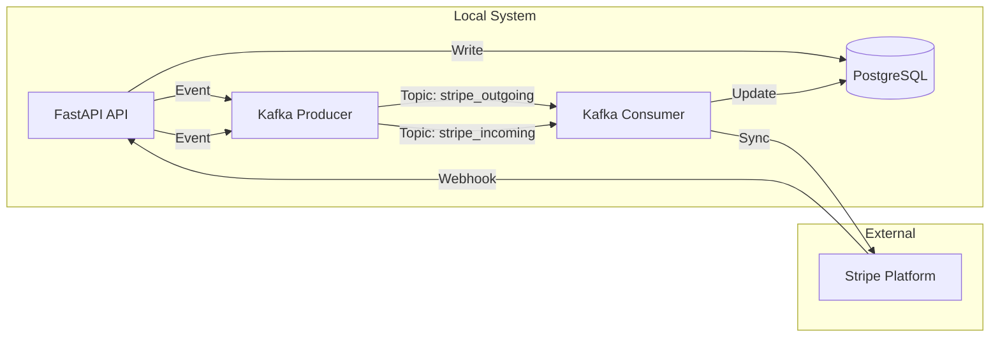

# Real-Time Two-Way Payment Synchronization Engine

A robust, event-driven synchronization service designed to maintain real-time data consistency between an internal customer database and Stripe. Built with **FastAPI**, **Apache Kafka**, and **PostgreSQL**.

## 🚀 Overview

This engine solves the problem of keeping distributed systems in sync. It implements a bi-directional data flow:
1.  **Outward Sync**: Changes in the local application are published to a Kafka queue and asynchronously propagated to Stripe.
2.  **Inward Sync**: Events from Stripe (via Webhooks) are captured, queued, and processed to update the local database.

This architecture ensures **eventual consistency**, **fault tolerance**, and **scalability**, decoupling the user-facing API from external third-party latency.

## 🛠️ Tech Stack

*   **Backend**: Python 3.10+, FastAPI
*   **Database**: PostgreSQL, SQLAlchemy ORM
*   **Message Queue**: Apache Kafka (Confluent)
*   **Infrastructure**: Docker, Docker Compose
*   **External Integration**: Stripe API & Webhooks

## 🏗️ Architecture

The system utilizes a **Producer-Consumer** pattern to handle data synchronization.



## ⚡ Features

*   **Asynchronous Processing**: Uses background workers to handle sync tasks without blocking the main API thread.
*   **Fault Tolerance**: Kafka message persistence ensures that temporary network failures don't result in data loss; messages are retried until success.
*   **Bi-Directional Sync**:
    *   **Create/Update/Delete** locally → Reflects in Stripe.
    *   **Create/Update/Delete** in Stripe Dashboard → Reflects locally.
*   **Containerized**: Entire stack (App, DB, Zookeeper, Kafka) runs with a single `docker-compose` command.

## 🏁 Getting Started

### Prerequisites
*   Docker & Docker Compose
*   Python 3.10+ (for local development)
*   Stripe Account (Test Mode)
*   [Ngrok](https://ngrok.com/) (for local webhook testing)

### 🔧 Installation & Setup

1.  **Clone the repository**
    ```bash
    git clone https://github.com/Siddharth-Xenon/Two-way-payment-integration.git
    cd Two-way-payment-integration
    ```

2.  **Configure Environment**
    Create a `.env` file in the root directory:
    ```ini
    DB_USERNAME=postgres
    DB_PASSWORD=password
    DB_HOST=db
    DB_NAME=payments
    DB_PORT=5432
    STRIPE_API_KEY=sk_test_...
    STRIPE_WEBHOOK_SECRET=whsec_...
    ```

3.  **Start Services (Docker)**
    ```bash
    docker-compose up -d --build
    ```
    This spins up Zookeeper, Kafka, PostgreSQL, and the FastAPI application.

4.  **Local Webhook Setup (Ngrok)**
    To receive events from Stripe locally:
    ```bash
    ngrok http 8000
    ```
    *   Copy the https URL (e.g., `https://xyz.ngrok.io`).
    *   Add endpoint in Stripe Dashboard: `https://xyz.ngrok.io/webhook`.
    *   Select events: `customer.created`, `customer.updated`, `customer.deleted`.

### 🏃‍♂️ usage

*   **API Docs**: Visit `http://localhost:8000/docs` to interact with the API.
*   **Create Customer**: POST `/customers/` - triggers sync to Stripe.
*   **Stripe Update**: Change a customer in Stripe Dashboard - verification log appears in app console.
